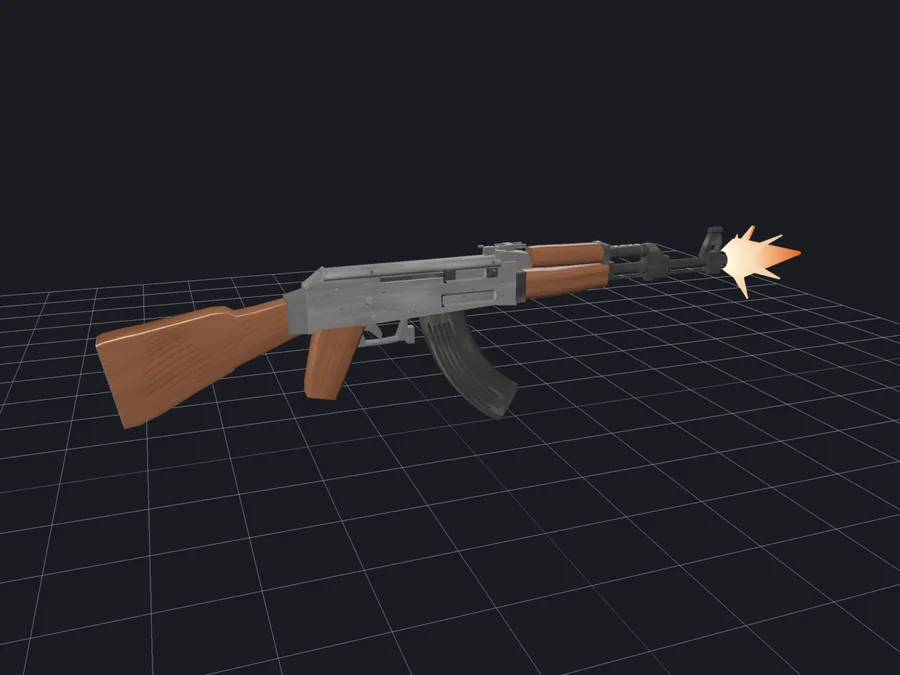
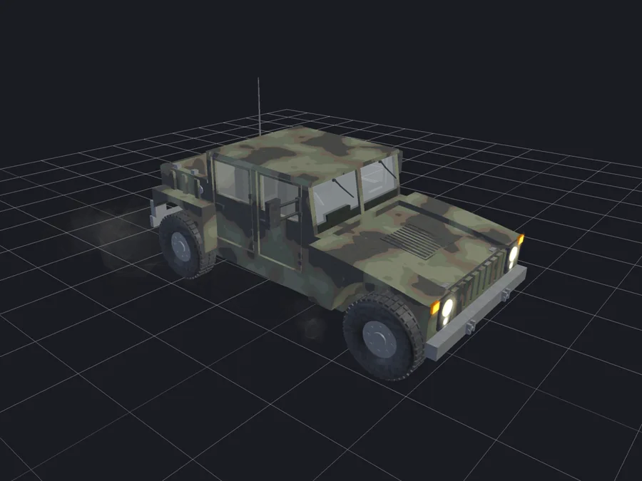

# Agentic 3D modeling

Raylib 3D models and animations, written by Claude Code and reviewed by Codex.

|                                                                   |
| :---------------------------------------------------------------: |
|                 AK-47 firing a three-round burst                  |
|         |
|                HMMWV driving over a periodic road                 |
|  |

## Usage

**Preview**: opens a window on the model. Drag to orbit, wheel to zoom, space toggles the spin, R resets the camera, ESC quits.

```sh
./build/ak47
```

**Save**: renders `--frames` evenly spaced views to PNG and exits, no window. Add `--anim` to hold the camera still and step the pose through one cycle instead of orbiting.

```sh
./build/ak47 --shots renders/ak47/v1 --frames 8 --size 1600x1200 --supersample 3
./build/crank_slider --shots renders/crank_slider/v1 --anim --frames 8
```
